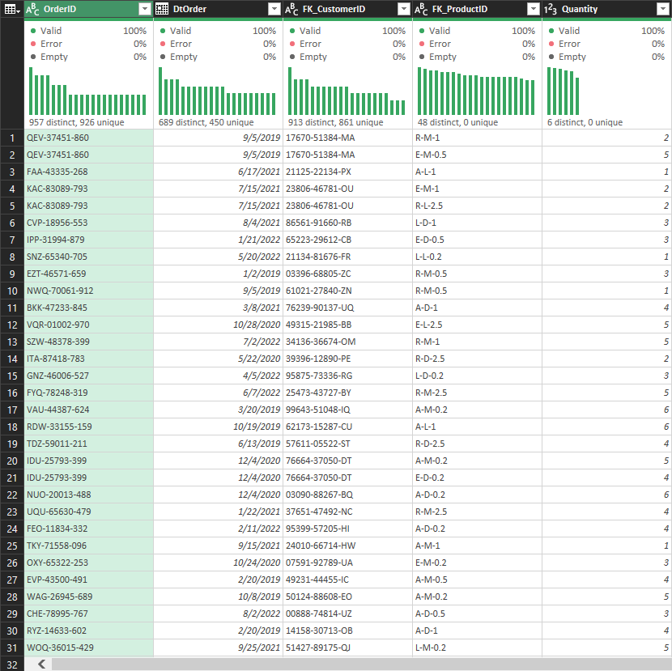
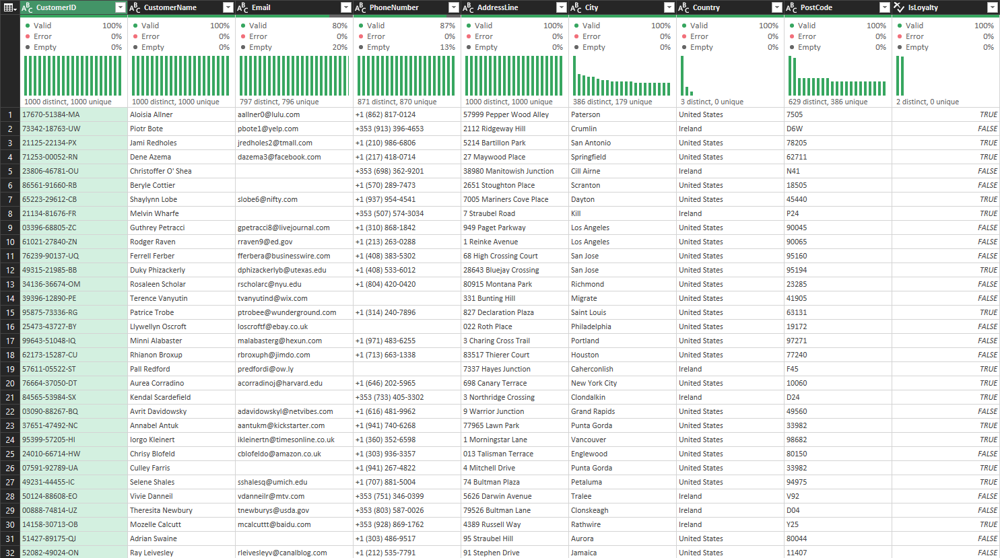
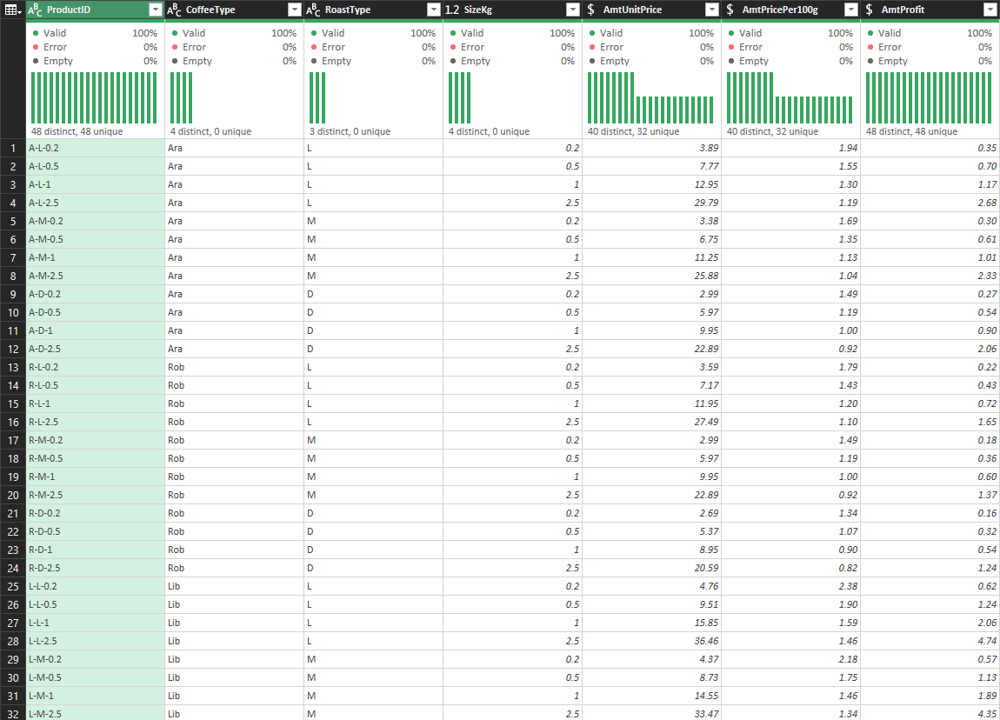

# Coffee Bean Sales Analysis

## Project Overview 🌟

This project examines coffee bean sales data to uncover business insights using Microsoft Excel. The analysis focuses on understanding sales patterns, customer behavior, and product performance through detailed data integration and analysis.

## Dataset Description 📊

Three interconnected datasets form the foundation of this analysis:

- **Orders Dataset** (1000 records)
  - Contains primary transaction data: order IDs, dates, and quantities
  - Features multiple line items per order ID for granular purchase analysis
  
- **Customers Dataset**
  - Holds customer profiles and demographics
  - Includes loyalty program participation status
  
- **Products Dataset**
  - Stores coffee product specifications
  - Contains pricing structure and profit margins

The `CustomerID` and `ProductID` foreign keys link these datasets, enabling multi-dimensional analysis across the business operation.

## Methodology

### 1. Data Import and Preparation Process

#### 1.1 Data Import Strategy

Power Query serves as the primary data handling tool. However, given the relatively small size of our datasets, alternative methods would be equally effective.

- **Source Files** (located in 'datasets' folder):
  - orders.csv
  - customers.csv
  - products.csv

#### 1.2 Data Standardization Implementation

The standardization protocol addresses two key areas:

**A. Field Naming Conventions**

A systematic prefix system identifies field types instantly:
- `Dt` - Date fields (Example: DtOrder)
- `FK` - Foreign keys (Example: FK_CustomerID)
- `Amt` - Monetary values (Example: AmtUnitPrice)
- `Is/Has` - Boolean flags (Example: IsLoyalty)

**B. Data Type Configuration**

Each table requires specific data types for accurate analysis:

**Orders Table Configuration**
| Column Name | Data Type | Purpose |
|-------------|-----------|----------|
| OrderID | Text | Identifies unique transactions |
| DtOrder | Date | Records transaction time |
| FK_CustomerID | Text | Links to customer data |
| FK_ProductID | Text | Links to product data |
| Quantity | Whole Number | Tracks purchase volume |



**Customers Table Configuration**
| Column Name | Data Type | Purpose |
|-------------|-----------|----------|
| CustomerID | Text | Identifies customers uniquely |
| CustomerName | Text | Stores customer names |
| Email | Text | Records primary contact |
| PhoneNumber | Text | Stores secondary contact |
| AddressLine | Text | Captures shipping details |
| City | Text | Enables geographic analysis |
| Country | Text | Supports regional analysis |
| PostCode | Text | Facilitates location grouping |
| IsLoyalty | True/False | Tracks program participation |

Important: Transform `IsLoyalty` from "Yes"/"No" to TRUE/FALSE in Power Query for proper boolean handling.



**Products Table Configuration**
| Column Name | Data Type | Purpose |
|-------------|-----------|----------|
| ProductID | Text | Identifies products uniquely |
| CoffeeType | Text | Categorizes products |
| RoastType | Text | Specifies roast level |
| SizeKg | Decimal Number | Records package size |
| AmtUnitPrice | Currency | Sets retail price |
| AmtPricePer100g | Currency | Enables price comparison |
| AmtProfit | Currency | Tracks profit margins |



### 2. Data Integration Strategy

#### 2.1 Customer Data Integration

XLOOKUP functions populate the Orders table with customer information:

**Customer Name Integration:**
```excel
=XLOOKUP([@[FK_CustomerID]],Customers[CustomerID],Customers[CustomerName],,0)
```

**Email Integration:**
```excel
=XLOOKUP([@[FK_CustomerID]],Customers[CustomerID],Customers[Email],,0)
```

**Country Integration:**
```excel
=XLOOKUP([@[FK_CustomerID]],Customers[CustomerID],Customers[Country],,0)
```

Results show comprehensive transaction details:

| OrderID | DtOrder | FK_CustomerID | FK_ProductID | Quantity | CustomerName | Email | Country |
|---------|---------|---------------|--------------|----------|--------------|-------|---------|
| QEV-37451-860 | 9/5/2019 | 17670-51384-MA | R-M-1 | 2 | Aloisia Allner | aallner0@lulu.com | United States |
| QEV-37451-860 | 9/5/2019 | 17670-51384-MA | E-M-0.5 | 5 | Aloisia Allner | aallner0@lulu.com | United States |

#### 2.2 Product Data Integration

A dynamic INDEX-MATCH formula integrates product data efficiently:

```excel
=INDEX(Products,
    MATCH(Orders[@[FK_ProductID]:[FK_ProductID]],Products[[ProductID]:[ProductID]],0),
    MATCH(Orders[[#Headers],[CoffeeType]],Products[#Headers],0))
```

**Formula Components:**
1. `INDEX(Products,...)`: Points to the Products table
2. First `MATCH`: Locates product rows via FK_ProductID
3. Second `MATCH`: Finds correct columns dynamically

Copy this formula across product-related columns: `CoffeeType`, `RoastType`, `SizeKg`, and `AmtUnitPrice`.

#### 2.3 Sales Calculation

Multiply unit price by quantity to calculate total sales:

```excel
=[@AmtUnitPrice] * [@Quantity]
```

The final integrated dataset displays complete transaction information:

| OrderID       | DtOrder  | FK_CustomerID  | FK_ProductID | Quantity | CustomerName   | Email             | Country       | CoffeeType | RoastType | SizeKg | AmtUnitPrice | AmtSales |
|---------------|----------|----------------|--------------|----------|----------------|-------------------|---------------|------------|-----------|--------|--------------|----------|
| QEV-37451-860 | 9/5/2019 | 17670-51384-MA | R-M-1        | 2        | Aloisia Allner | aallner0@lulu.com | United States | Rob        | M         | 1.0    | $9.95        | $19.90   |

## Technical Requirements 💻

- Microsoft Excel 2016 or later
- Power Query enabled
- Basic Excel formula and data analysis knowledge

## Project Status 🚧

Current development expands into:
- Advanced sales trend analysis
- Customer behavior segmentation
- Product performance optimization
- Geographical market insights

## Getting Started 🚀

1. Clone the repository
2. Open the Excel workbook
3. Verify Power Query connections
4. Follow data preparation steps
5. Begin analysis using documented methodology