# Coffee Bean Sales Analysis

## Project Overview 🌟

This project examines coffee bean sales data to uncover business insights using Microsoft Excel. The analysis focuses on understanding sales patterns, customer behavior, and product performance through detailed data integration and analysis.

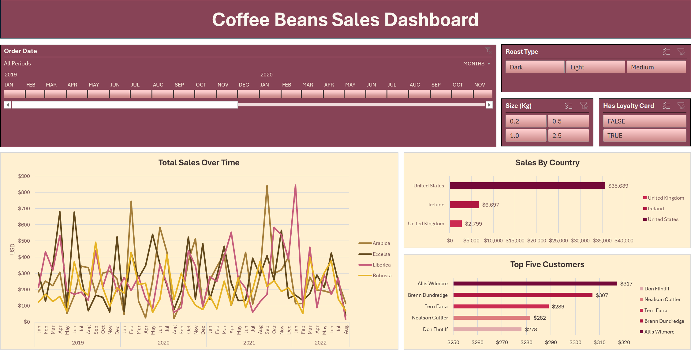

## Dataset Description 📊

Three core datasets track coffee sales:

- **Orders**: Transaction records of customer purchases
- **Customers**: Customer profiles and demographics 
- **Products**: Coffee product specifications and pricing

The datasets link through `CustomerID` and `ProductID` keys.

## Methodology

### 1. Data Import and Preparation Process

#### 1.1 Data Import Strategy

Import data using Power Query. While other methods work for these small datasets, Power Query provides the most efficient approach.

Format all datasets as tables rather than ranges to facilitate pivot table creation and updating later. Power Query handles this table formatting automatically.

Source files in the 'datasets' folder:
- orders.csv 
- customers.csv
- products.csv

#### 1.2 Data Standardization

Implement standardization across two key areas:

#### Field Naming Conventions

Use these prefixes to identify field types:
- `Dt` - Date fields (Example: `DtOrder`)
- `FK` - Foreign keys (Example: `FK_CustomerID`) 
- `Amt` - Monetary values (Example: `AmtUnitPrice`)
- `Is/Has` - Boolean flags (Example: `HasLoyalty`)

#### Data Type Configuration

Set column names and data types for each table:

**Orders Table**
| Column Name | Data Type | Purpose |
|-------------|-----------|----------|
| `OrderID` | Text | Unique transaction identifier |
| `DtOrder` | Date | Transaction timestamp |
| `FK_CustomerID` | Text | Customer reference |
| `FK_ProductID` | Text | Product reference |
| `Quantity` | Whole Number | Units purchased |
| `CustomerName` | Text | Customer name (to be filled) |
| `Email` | Text | Customer email (to be filled) |
| `Country` | Text | Customer country (to be filled) |
| `CoffeeType` | Text | Coffee type (to be filled) |
| `RoastType` | Text | Roast type (to be filled) |
| `SizeKg` | Decimal Number | Package size (to be filled) |
| `AmtUnitPrice` | Currency | Unit price (to be filled) |

Note: Empty columns for customer and product data will be populated later through lookups. Rename these columns to match their corresponding new names from the customers and products tables.

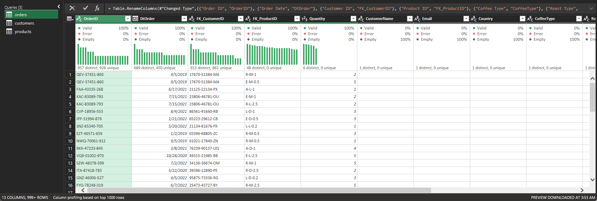

**Customers Table**
| Column Name | Data Type | Purpose |
|-------------|-----------|----------|
| `CustomerID` | Text | Unique customer identifier |
| `CustomerName` | Text | Customer's full name |
| `Email` | Text | Primary contact |
| `PhoneNumber` | Text | Secondary contact |
| `AddressLine` | Text | Shipping location |
| `City` | Text | Geographic region |
| `Country` | Text | Regional market |
| `PostCode` | Text | Location grouping |
| `HasLoyalty` | True/False | Program membership status |

Note: Convert `HasLoyalty` "Yes"/"No" values to TRUE/FALSE in Power Query.

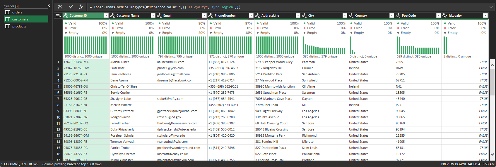

**Products Table**
| Column Name | Data Type | Purpose |
|-------------|-----------|----------|
| `ProductID` | Text | Unique product identifier |
| `CoffeeType` | Text | Product category |
| `RoastType` | Text | Roast classification |
| `SizeKg` | Decimal Number | Package weight |
| `AmtUnitPrice` | Currency | Retail price |
| `AmtPricePer100g` | Currency | Unit price comparison |
| `AmtProfit` | Currency | Margin per unit |

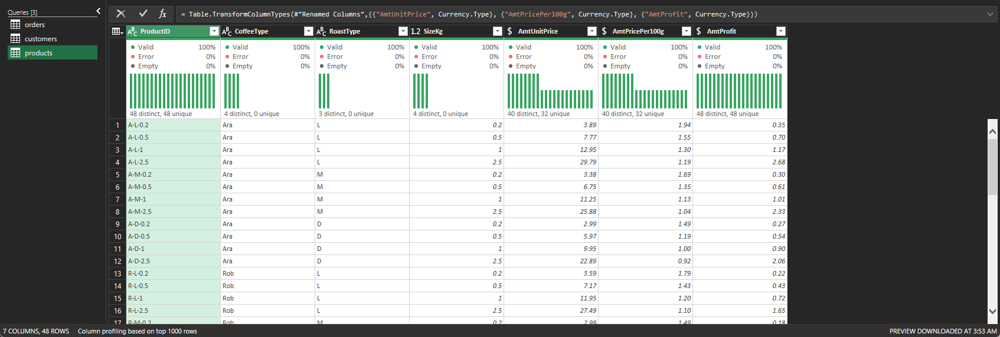

### 2. Data Integration

#### 2.1 Customer Data Integration 

Integrate customer details (`CustomerName`, `Email`, `Country`) from the `Customers` table into the `Orders` table using `CustomerID` (named `FK_CustomerID` in Orders table) as the linking key.

Apply these `XLOOKUP` formulas to retrieve customer data:

```excel
# Get customer name
=XLOOKUP([@[FK_CustomerID]], Customers[CustomerID], Customers[CustomerName])

# Get customer email
=XLOOKUP([@[FK_CustomerID]], Customers[CustomerID], Customers[Email]) 

# Get customer country
=XLOOKUP([@[FK_CustomerID]], Customers[CustomerID], Customers[Country])
```

The integrated table now includes the following data (excluding product-related data to be added soon):

| Column | Description |
|--------|-------------|
| `OrderID` | Unique order identifier |
| `DtOrder` | Order date |
| `FK_CustomerID` | Foreign key matching `CustomerID` in Customers table |
| `FK_ProductID` | Foreign key linking to Products table |
| `Quantity` | Number of units ordered |
| `CustomerName` | Retrieved customer name |
| `Email` | Retrieved customer email |
| `Country` | Retrieved customer country |

This integration creates a comprehensive view of each order with essential customer details readily available.

#### 2.2 Product Data Integration 

Integrate product details (`CoffeeType`, `RoastType`, `SizeKg`, `AmtUnitPrice`) from the `Products` table into the `Orders` table using `ProductID` (named `FK_ProductID` in Orders table) as the linking key.

Start with `CoffeeType` using this `INDEX-MATCH` formula:

```excel
=INDEX(Products,
    MATCH(Orders[@[FK_ProductID]:[FK_ProductID]], Products[[ProductID]:[ProductID]], 0),
    MATCH(Orders[[#Headers],[CoffeeType]], Products[#Headers], 0))
```

Copy this dynamic formula to populate the remaining product-related columns.

Formula breakdown:
- `INDEX(Products,...)` references the entire Products table range
- First `MATCH` finds the row position:
  - `Orders[@[FK_ProductID]:[FK_ProductID]]` uses absolute references for the lookup value
  - `Products[[ProductID]:[ProductID]]` uses absolute references for the lookup array
- Second `MATCH` finds the column position:
  - `Orders[[#Headers],[CoffeeType]]` uses relative references that update for each column
  - `Products[#Headers]` contains the column headers

This formula structure maintains correct references when copied across product columns, ensuring accurate data retrieval.

#### 2.3 Sales Calculation

Calculate total sales in the `AmtSales` column by multiplying unit price by quantity:

```excel
=[@AmtUnitPrice] * [@Quantity]
```

The current integrated table structure includes:

| Column | Description |
|--------|-------------|
| `OrderID` | Unique order identifier |
| `DtOrder` | Order date |
..
| `FK_ProductID` | Foreign key matching `ProductID` in Products table |
| `Quantity` | Number of units ordered |
..
| `CoffeeType` | Type of coffee (Arabica, Robusta, etc.) |
| `RoastType` | Roast level (Light, Medium, Dark) |
| `SizeKg` | Package size in kilograms |
| `AmtUnitPrice` | Price per unit |
| ***`AmtSales`*** | ***Total sales amount*** |

This integration combines order details with product information and calculates sales values.

#### 2.4 Coffee Type and Roast Type Name Expansion

Add descriptive names for coffee and roast types by creating two new columns:

#### Coffee Type Names:
Create `CoffeeTypeName` using SWITCH to convert abbreviations in `CoffeeType` column to full names:
```excel
=SWITCH([@CoffeeType],
    "Rob", "Robusta",
    "Exc", "Excelsa", 
    "Ara", "Arabica",
    "Lib", "Liberica")
```

#### Roast Type Names:
Create `RoastTypeName` to expand single-letter codes found in `RoastType` column:
```excel
=SWITCH([@RoastType],
    "L", "Light",
    "M", "Medium",
    "D", "Dark")
```

The integrated table structure now includes:

| Column | Description |
|--------|-------------|
| `OrderID` | Unique order identifier |
| `DtOrder` | Order date |
...
| `CoffeeType` | Short code for coffee type |
| ***`CoffeeTypeName`*** | ***Full name of coffee type*** |
| `RoastType` | Single-letter roast code |
| ***`RoastTypeName`*** | ***Full name of roast type*** |
...
| `AmtSales` | Total sales amount |

This expansion improves data readability by converting abbreviated codes to their full descriptive names.

#### 2.5 Date Format Standardization

Standardize `DtOrder` column to use international date format (`dd-mmm-yyyy`) instead of American-style format:

```
# Before: 9/5/2019
# After:  05-Sep-2019
```

Current `Orders` table result:

| OrderID       | DtOrder     | FK_CustomerID  | FK_ProductID | Quantity | CustomerName        | Email                | Country       | CoffeeType | CoffeeTypeName | RoastType | RoastTypeName | SizeKg | AmtUnitPrice | AmtSales |
|---------------|-------------|----------------|--------------|----------|---------------------|----------------------|---------------|------------|----------------|-----------|---------------|--------|--------------|----------|
| QEV-37451-860 | 05-Sep-2019 | 17670-51384-MA | R-M-1        | 2        | Aloisia Allner      | aallner0@lulu.com    | United States | Rob        | Robusta        | M         | Medium        | 1.0    | $9.95        | $19.90   |
| QEV-37451-860 | 05-Sep-2019 | 17670-51384-MA | E-M-0.5      | 5        | Aloisia Allner      | aallner0@lulu.com    | United States | Exc        | Excelsa        | M         | Medium        | 0.5    | $8.25        | $41.25   |
| FAA-43335-268 | 17-Jun-2021 | 21125-22134-PX | A-L-1        | 1        | Jami Redholes       | jredholes2@tmall.com | United States | Ara        | Arabica        | L         | Light         | 1.0    | $12.95       | $12.95   |
| KAC-83089-793 | 15-Jul-2021 | 23806-46781-OU | E-M-1        | 2        | Christoffer O' Shea |                      | Ireland       | Exc        | Excelsa        | M         | Medium        | 1.0    | $13.75       | $27.50   |
| KAC-83089-793 | 15-Jul-2021 | 23806-46781-OU | R-L-2.5      | 2        | Christoffer O' Shea |                      | Ireland       | Rob        | Robusta        | L         | Light         | 2.5    | $27.49       | $54.97   |
...

#### 2.6 Checking for Duplicates

Check for duplicate records using Excel's Remove Duplicates feature:
- Go to Data tab
- In Data Tools group, click Remove Duplicates
- Select all columns for comparison
- Click OK

Result: No duplicate records were found in the dataset, indicating clean data entry and collection practices.

### 3. Initial Dashboard Elements and Sales Analysis

The initial dashboard components establish core visualizations and maintain consistent styling guidelines for future expansion.

#### 3.1 Pivot Table and Chart Creation

In a new sheet named `TotalSales`, create a pivot table (also named `TotalSales`) from the `Orders` table with the following settings:
- Add `DtOrder` to rows (group by months and years)
- Place `CoffeeTypeName` in columns 
- Place `AmtSales` in the values field and format it as USD currency without decimals.
- Apply tabular form layout
- Remove grand totals and subtotals

| Sum of AmtSales |                  | CoffeeTypeName |             |             |            |             |
|-----------------|------------------|----------------|-------------|-------------|------------|-------------|
| Years (DtOrder) | Months (DtOrder) | Arabica        | Excelsa     | Liberica    | Robusta    | Grand Total |
| 2019            | Jan              | $187           | $306        | $213        | $123       | $829        |
|                 | Feb              | $252           | $129        | $434        | $172       | $987        |
|                 | Mar              | $225           | $349        | $321        | $126       | $1,021      |
...
| 2019 Total      |                  | $2,927         | $3,481      | $3,378      | $2,401     | $12,187     |
...
| 2020            | Jul              | $431           | $227        | $236        | $415       | $1,309      |
|                 | Aug              | $23            | $78         | $61         | $140       | $300        |
...
| 2020 Total      |                  | $3,356         | $3,663      | $2,604      | $2,493     | $12,118     |
...
| **Grand Total** |                  | **$11,768**    | **$12,306** | **$12,054** | **$9,005** | **$45,134** |

Create a line chart from this pivot table. Hide all field buttons, add chart and axis titles, and apply formatting for improved readability.

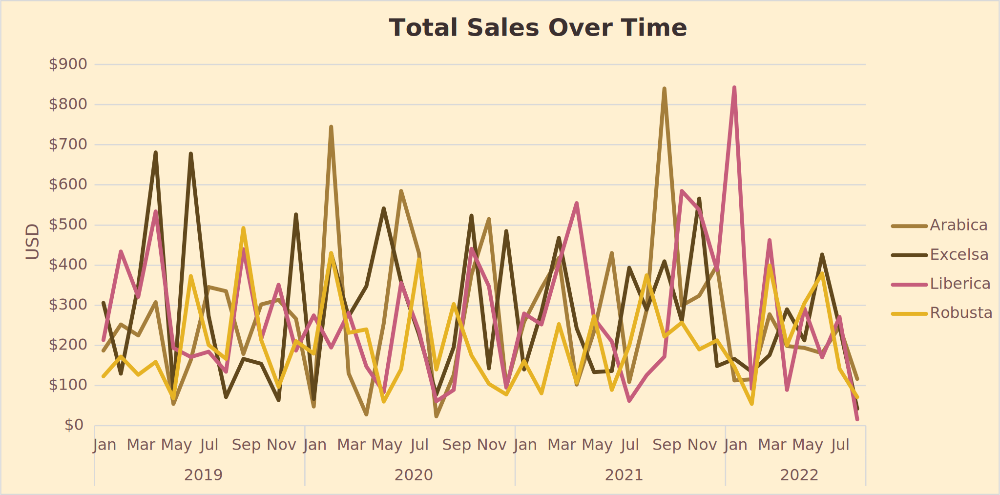

#### 3.2 Timeline Creation

Add a timeline filter using `DtOrder` to analyze data across different periods. Position the customized timeline above the sales chart for easy date range selection.

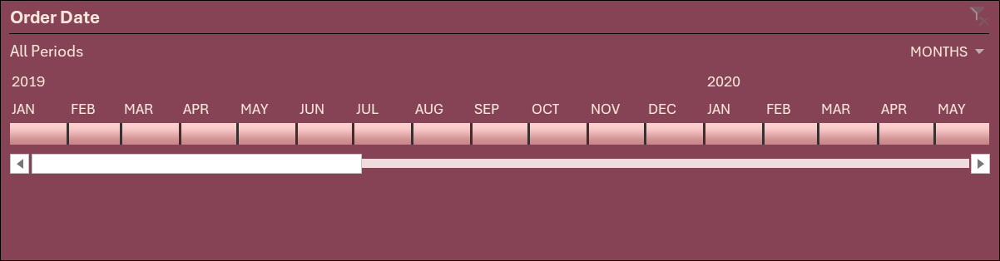


Filter data by dragging timeline endpoints or selecting specific periods to analyze sales patterns.

#### 3.3 Add Loyalty Status to Orders

Add `HasLoyalty` from the `Customers` table to the `Orders` table using this `XLOOKUP` formula:

```excel
=XLOOKUP([@[FK_CustomerID]], Customers[CustomerID], Customers[HasLoyalty])
```

Final `Orders` table structure:

| Column | Description |
|--------|-------------|
| `OrderID` | Unique order identifier |
| `DtOrder` | Order date |
| `FK_CustomerID` | Customer reference |
| `FK_ProductID` | Product reference |
| `Quantity` | Units ordered |
| `CustomerName` | Customer name |
| `Email` | Customer email |
| `Country` | Customer country |
| ***`HasLoyalty`*** | ***Loyalty program status*** |
| `CoffeeType` | Coffee type |
| `CoffeeTypeName` | Full coffee type name |
| `RoastType` | Roast level code |
| `RoastTypeName` | Full roast level name |
| `SizeKg` | Package size |
| `AmtUnitPrice` | Price per unit |
| `AmtSales` | Total sales amount |

#### 3.4 Slicer Configuration

Add and configure three slicers to enable interactive filtering. Apply dashboard styling to match existing elements' colors, fonts, and spacing.

Configure slicer layouts:
- `RoastTypeName`: Display 3 columns
- `SizeKg`: Display 2 columns  
- `HasLoyalty`: Display 1 column

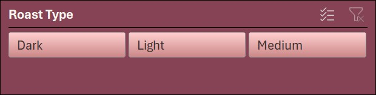
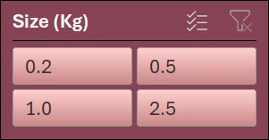 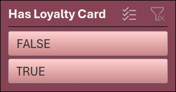

### 4. Expanding Dashboard Components

Create focused visualizations to analyze sales patterns across countries and top customers.

#### 4.1 Bar Chart Sales By Country

Create foundation pivot table:
- Copy `TotalSales` sheet > Rename to `CountryBarChart` > Remove existing visualizations
- Clear all fields except `AmtSales` in values area
- Add `Country` to rows > Sort by `Sum of AmtSales` (ascending)

View pivot table results:

| Country         | Sum of AmtSales |
|-----------------|-----------------|
| United Kingdom  | $2,799          |
| Ireland         | $6,697          |
| United States   | $35,639         |
| **Grand Total** | **$45,134**     |

Build visualization:
- Insert bar chart based on pivot table > Hide field buttons > Add title > Configure data labels (outside end)

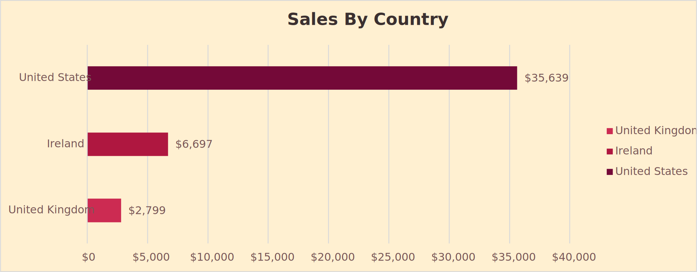

#### 4.2 Top Customers

Configure analysis sheet:
- Copy `CountryBarChart` sheet > Rename to `TopFiveCustomers`
- Swap `Country` for `CustomerName` in rows
- Apply top 5 value filter > Sort by `Sum of AmtSales` (ascending)

Review pivot table output:

| CustomerName    | Sum of AmtSales |
|-----------------|-----------------|
| Don Flintiff    | $278            |
| Nealson Cuttler | $282            |
| Terri Farra     | $289            |
| Brenn Dundredge | $307            |
| Allis Wilmore   | $317            |
| **Grand Total** | **$1,473**      |

Finalize visualization:
- Let chart update automatically with new data > Update title to reflect top customer focus

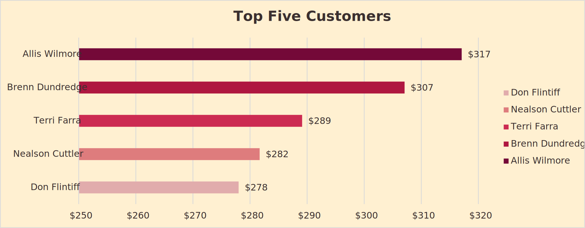

### 5. Finalizing Dashboard and Sales Analysis

Create unified sales dashboard with synchronized filtering capabilities.

#### 5.1 Dashboard Layout

Create dashboard frame:
- New sheet `Dashboard` > Add title rectangle `Coffee Beans Sales Dashboard` > Apply styling

Arrange elements:
- Import all charts (`TotalSales` + `CountryBarChart` + `TopFiveCustomers`) > Align to grid > Use margins
- Link timeline/slicers to all sheets > Test filter synchronization

The final dashboard combines all visualizations in a cohesive layout with synchronized interactive filtering.


## Technical Requirements 💻

- Microsoft Excel 2016 or later
- Power Query enabled
- Basic Excel formula and data analysis knowledge

## Getting Started 🚀

1. Clone the repository
2. Open the Excel workbook
3. Verify Power Query connections
4. Follow data preparation steps
5. Begin analysis using documented methodology